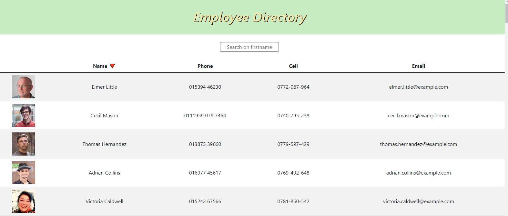
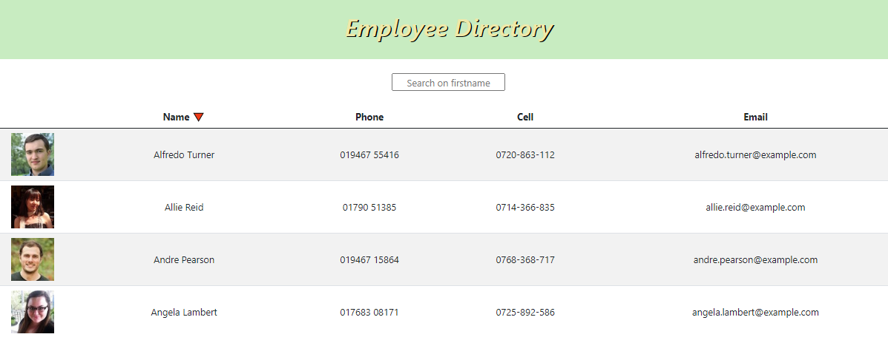
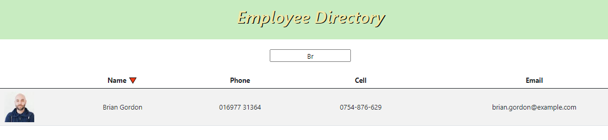

# React Employee Directory
This repository obtains, via an api, details of employees.  These employees are then displayed on to a web page via code created in React.  
This assignment also required the breaking up of the application's UI into components, manage component state and also respond to user events.

This is the link to the Heroku deployment:  

https://calm-eyrie-16059.herokuapp.com/

## *Table of Contents*
- [Description](#description)
- [Installation](#installation)
- [Usage](#usage)
- [Credits](#Credits) 
- [Contributing and Questions](#contributing)
- [Contact Me](#contact-me)

This system has the following landing page:
 

## *Installation*
To run this webpage, click on the Heroku link above.

 ## Usage

 The user is first presented with the landing page above.  

Clicking on Name 🔻 will sort the employee table by their first name:

 

it is possible to search on the first name of an employee by typing their first name (case sensitive) or part of their first name inside and pressing return inside the 'Search on firstname' box.

 

 ## Credits
 1. BCS for their timely support.
 2. Paul and Chiggy

## *Contributing and Questions*
For any suggestions or questions, please feel free to contact us via our Github pages shown below.

##Contact Me
Sally Rodgers https://github.com/sallyxp
LinkedIn: **[Sally Rodgers](www.linkedin.com/in/sallyhello1

This project is MIT licensed.  
&copy;

